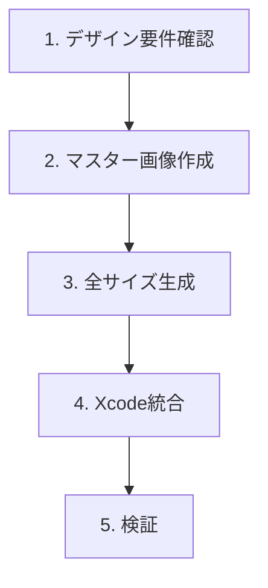

# iOS App Icon Creation

iOSアプリアイコンの設計・作成・Xcode統合のワークフロー。

## ワークフロー



## 1. デザイン要件確認

### 必須仕様

| 項目               | 要件                                 |
| ------------------ | ------------------------------------ |
| マスター画像サイズ | 1024×1024 px                         |
| フォーマット       | PNG（透明背景は不可、iOS 18+を除く） |
| カラースペース     | Display P3またはsRGB                 |
| 角丸               | **不要**（システムが自動適用）       |

### プラットフォーム別サイズ

| プラットフォーム | サイズ（px） | スケール |
| ---------------- | ------------ | -------- |
| iPhone           | 60×60        | 2x, 3x   |
| iPad             | 76×76        | 1x, 2x   |
| iPad Pro         | 83.5×83.5    | 2x       |
| App Store        | 1024×1024    | 1x       |
| Spotlight        | 40×40        | 2x, 3x   |
| Settings         | 29×29        | 2x, 3x   |
| Notification     | 20×20        | 2x, 3x   |

詳細は [references/icon-sizes.md](references/icon-sizes.md) を参照。

## 2. マスター画像作成

### デザインガイドライン

1. **シンプルな形状**: 一目で認識できるアイコン
2. **限定された色数**: 2-4色を推奨
3. **高コントラスト**: 小サイズでも識別可能
4. **背景色必須**: 透明背景は避ける
5. **テキスト非推奨**: テキストは判読困難

### 作成方法

#### オプションA: generate_image を使用

```
# AIによる画像生成
generate_image で 1024x1024 の正方形アイコンを生成
- 形状: シンプルで識別しやすい
- 背景: 単色または軽いグラデーション
- 角丸: 適用しない（OSが自動処理）
```

#### オプションB: 手動デザイン（Figma/Sketch等）

- テンプレート: [assets/figma-template.md](assets/figma-template.md)
- グリッドシステム適用を推奨

### iOS 18+ Dark/Tinted対応

iOS 18以降では3バリアント対応が可能：

| バリアント | 説明                               |
| ---------- | ---------------------------------- |
| Light      | 標準アイコン（必須）               |
| Dark       | ダークモード用（オプション）       |
| Tinted     | ユーザーカスタム色用（オプション） |

詳細は [references/dark-tinted.md](references/dark-tinted.md) を参照。

## 3. 全サイズ生成

### 自動生成スクリプト

```bash
python scripts/generate_icons.py <master_image.png> <output_dir>
```

スクリプトは `scripts/generate_icons.py` を使用。

### 手動生成（sipsコマンド）

```bash
# 例: 60x60 @2x を生成
sips -Z 120 master_icon.png --out AppIcon60x60@2x.png
```

## 4. Xcode統合

### Assets.xcassets 配置

```
Assets.xcassets/
└── AppIcon.appiconset/
    ├── Contents.json
    ├── icon-1024.png       # App Store
    ├── icon-60@2x.png      # iPhone
    ├── icon-60@3x.png      # iPhone
    ├── icon-76.png         # iPad
    ├── icon-76@2x.png      # iPad
    └── ...
```

### Contents.json 生成

`scripts/generate_icons.py` が自動生成。手動の場合は [references/contents-json.md](references/contents-json.md) を参照。

## 5. 検証

### チェックリスト

- [ ] 全必須サイズが存在
- [ ] 透明ピクセルがない
- [ ] 角丸が適用されていない
- [ ] Contents.jsonが正しい
- [ ] ビルドエラーがない
- [ ] シミュレーターで表示確認

### App Store審査ポイント

- マーケティング画像と一致
- 著作権侵害がない
- 不適切なコンテンツがない

## 他スキルとの連携

- **hig-ooui-mobile-design**: HIGベースのUI設計
- **canvas-design**: カスタムアートワーク作成
- **fastlane-appstore-release**: App Store提出

## References

- [references/icon-sizes.md](references/icon-sizes.md) - 全プラットフォームサイズ一覧
- [references/dark-tinted.md](references/dark-tinted.md) - iOS 18+ Dark/Tinted対応
- [references/contents-json.md](references/contents-json.md) - Contents.json仕様
